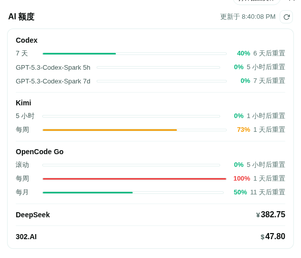

# dsh-ai-quota

DeepSeek Harness 插件：查询你的 AI 订阅额度 / 余额 —— **Codex**、**Kimi**、**DeepSeek**、**302.AI**、**OpenCode Go** 五个 provider 一处可见。

[](https://github.com/topics/dsh-plugin) [](https://github.com/Carrick-K7/dsh-ai-quota) [](./LICENSE)

[English](README.md) · 中文

## 预览



*设置页：Codex / Kimi / OpenCode Go 的用量进度条 + DeepSeek / 302.AI 的简洁余额，手动刷新，以及跟随当前模型的输入框额度行。*

## 功能

- **模型工具 `query_ai_quota`**：任何 agent 会话里直接问「查一下我的 AI 额度」，返回人类可读摘要。
- **设置页**：设置侧边栏新增「AI 额度」页，每个 provider 的用量进度条 / 余额 + 手动刷新。
- **输入框额度行**：跟随当前模型的一行极简额度提示，新建页面与会话中都显示。
- **自动刷新**：host 每 `refreshIntervalMs`（默认 2 分钟）全量查询一次并写缓存，前端与工具秒回；`0` 关闭。
- **统一格式**：订阅制窗口 / 余额两种形态归一化，单个 provider 失败不影响其他。
- **不泄露密钥**：API key / token 永不进入工具输出、Remote 结果与日志。

## 安装

```sh
dsh plugin --profile web add github:Carrick-K7/dsh-ai-quota
# 或本地目录：dsh plugin --profile web add file:/path/to/dsh-ai-quota
```

包内 `cordis.patch.yml`（通过 package.json 的 `dsh.bundle.patch` 声明）会让 `dsh plugin` 自动把插件行追加到 `dsh.profile.bundles`。改完重启 `dsh web` 生效（需要 pnpm 在 PATH 上）。

## 配置（插件行 config，均可选）

| Key | 默认值 | 含义 |
| --- | --- | --- |
| `timeoutMs` | `15000` | 单 provider 查询超时（毫秒） |
| `refreshIntervalMs` | `120000` | 全局自动刷新间隔（毫秒），`0` = 关闭 |
| `codexCli` | `codex` | codex CLI 命令名或绝对路径 |
| `deepseekApiKeyEnv` | `DEEPSEEK_API_KEY` | DSH 凭据引用名（回退同名环境变量） |
| `opencodeGoApiKeyEnv` | `OPENCODE_GO_API_KEY` | DSH 凭据引用名（回退同名环境变量） |
| `ai302ApiKeyEnv` | `AI_302_API_KEY` | DSH 凭据引用名（回退同名环境变量） |
| `deepseekBaseUrl` | `https://api.deepseek.com` | DeepSeek API 基地址 |
| `opencodeBaseUrl` | `https://opencode.ai/zen/go/v1/usage` | OpenCode Go 用量端点 |
| `ai302BaseUrl` | `https://api.302.ai` | 302.AI API 基地址 |
| `kimiBaseUrl` | `https://api.kimi.com/coding/v1` | Kimi Code 用量端点基地址（追加 `/usages`） |
| `kimiOauthHost` | `https://auth.kimi.com` | Kimi OAuth 刷新端点（追加 `/api/oauth/token`） |
| `kimiClientId` | Kimi Code CLI 的公开 client id | OAuth client_id（一般无需改） |

## 密钥来源

- **DeepSeek / 302.AI / OpenCode Go**：优先走 DSH 凭据 seam 解析——`apiKeyEnv` 是凭据引用名（默认 `DEEPSEEK_API_KEY` / `AI_302_API_KEY` / `OPENCODE_GO_API_KEY`），因此配置在 DSH 的 key（如 `$DSH_HOME/.credentials.yaml`）优先；同名进程环境变量仅作兜底（非 DSH 独立部署）。OpenCode Go 额外回退 `~/.local/share/opencode/auth.json` 的 `opencode-go` 条目。
- **Codex / Kimi**：无需 key，复用本地 CLI 登录态（codex 走 PATH 上的 CLI；Kimi 复用 Kimi Code CLI 的 OAuth 会话，过期自动续期，彻底失效时提示重新 `kimi login`）。

## 各 provider 数据来源

| Provider | 来源 |
| --- | --- |
| Codex | 本地 `codex app-server --stdio` JSON-RPC（`account/rateLimits/read`）— 5h / 7d 窗口 |
| Kimi | `GET {kimiBaseUrl}/usages`（Kimi Code CLI 的 OAuth 登录态） |
| DeepSeek | `GET {deepseekBaseUrl}/user/balance`（Bearer key） |
| 302.AI | `GET {ai302BaseUrl}/dashboard/balance`（Bearer key） |
| OpenCode Go | `GET {opencodeBaseUrl}`（Bearer key） |

## License

[MIT](./LICENSE)
